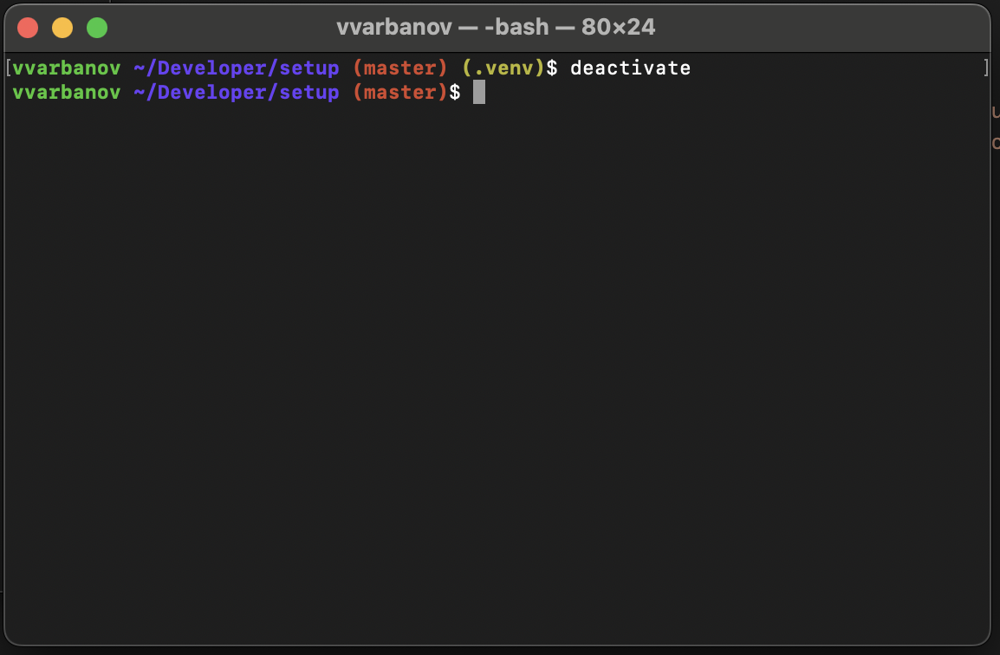

# Improved bash prompt

Git inspired by: https://github.com/magicmonty/bash-git-prompt/blob/master/gitstatus.sh

Supports showing interractive status in the prompt for:

* Git - current branch, clean/dirty status, comaprison to remote
* Python virtual environment - shows which virtual environment is used (if any)



Add to `.bashrc` or `.bash_profile`

```bash
export CLICOLOR=1

# colors
__color_reset='\[\033[00m\]'

__color_red_bold='\[\033[01;31m\]'
__color_green_bold='\[\033[01;32m\]'
__color_yellow_bold='\[\033[01;33m\]'
__color_blue_bold='\[\033[01;34m\]'
__color_magenta_bold='\[\033[01;35m\]'
__color_cyan_bold='\[\033[01;36m\]'


__GIT_PROMPT_IGNORE_STASH=1
__GIT_PROMPt_IGNORE_SUBMODULES="--ignore-submodules"
# git
__find_git_branch() {

	# branch base color
    local branch_color
	local branch=$(git branch --no-color 2> /dev/null | sed -e '/^[^*]/d' -e 's/* \(.*\)/\1/' )

    if [[ "$branch" != "" ]]; then

	    # some clever code copied from internet
		if [ -z "${__GIT_PROMPT_DIR}" ]; then
			local SOURCE="${BASH_SOURCE[0]}"
			while [ -h "${SOURCE}" ]; do
				local DIR="$( cd -P "$( dirname "${SOURCE}" )" && pwd )"
				SOURCE="$(readlink "${SOURCE}")"
				[[ $SOURCE != /* ]] && SOURCE="${DIR}/${SOURCE}"
			done
			__GIT_PROMPT_DIR="$( cd -P "$( dirname "${SOURCE}" )" && pwd )"
		fi

		local gitstatus=$( LC_ALL=C git --no-optional-locks status ${__GIT_PROMPt_IGNORE_SUBMODULES} --untracked-files=${__GIT_PROMPT_SHOW_UNTRACKED_FILES:-normal} --porcelain --branch )

		# if the status is fatal, exit now
		[[ "$?" -ne 0 ]] && exit 0

		local git_dir="$(git rev-parse --git-dir 2>/dev/null)"
		[[ -z "$git_dir" ]] && exit 0

		__git_prompt_read () {
			local f="$1"
			shift
			test -r "$f" && read "$@" <"$f"
		}

		local num_staged=0
		local num_changed=0
		local num_conflicts=0
		local num_untracked=0
		while IFS='' read -r line || [[ -n "$line" ]]; do
			local status=${line:0:2}
			while [[ -n $status ]]; do
				case "$status" in
					#two fixed character matches, loop finished
					\#\#) branch_line="${line/\.\.\./^}"; break ;;
					\?\?) ((num_untracked++)); break ;;
					U?) ((num_conflicts++)); break;;
					?U) ((num_conflicts++)); break;;
					DD) ((num_conflicts++)); break;;
					AA) ((num_conflicts++)); break;;
					#two character matches, first loop
					?M) ((num_changed++)) ;;
					?D) ((num_changed++)) ;;
					?\ ) ;;
					#single character matches, second loop
					U) ((num_conflicts++)) ;;
					\ ) ;;
					*) ((num_staged++)) ;;
				esac
				status=${status:0:(${#status}-1)}
			done
		done <<< "$gitstatus"

		local num_stashed=0
		if [[ "$__GIT_PROMPT_IGNORE_STASH" != "1" ]]; then
			local stash_file="$( git rev-parse --git-dir )/logs/refs/stash"
			if [[ -e "${stash_file}" ]]; then
				while IFS='' read -r wcline || [[ -n "$wcline" ]]; do
					((num_stashed++))
				done < ${stash_file}
			fi
		fi

		local clean=0
		if (( num_changed == 0 && num_staged == 0 && num_untracked == 0 && num_stashed == 0 && num_conflicts == 0)) ; then
			clean=1
		fi

		# my color setting
		if [[ $clean -ne 1 ]]; then
			branch_color=$__color_red_bold
		else
			branch_color=$__color_yellow_bold
		fi

		IFS="^" read -ra branch_fields <<< "${branch_line/\#\# }"
		local branch="${branch_fields[0]}"
		local remote=
		local upstream=

		if [[ "$branch" == *"Initial commit on"* ]]; then
			IFS=" " read -ra fields <<< "$branch"
			branch="${fields[3]}"
			# TODO fix remote
		elif [[ "$branch" == *"No commits yet on"* ]]; then
			IFS=" " read -ra fields <<< "$branch"
			branch="${fields[4]}"
			# TODO fix remote
		elif [[ "$branch" == *"no branch"* ]]; then
			local tag=$( git describe --tags --exact-match 2>/dev/null )
			if [[ -n "$tag" ]]; then
				branch="$tag"
				branch_color=$__color_cyan_bold
			else
				branch_color=$__color_magenta_bold
				branch="HEAD detached at $( git rev-parse --short HEAD )"
			fi
			if [[ $clean -ne 1 ]]; then # not clean non-branch
				branch="$branch$__color_red_bold ✖$branch_color"
			fi
		else
			if [[ "${#branch_fields[@]}" -eq 1 ]]; then
				# TODO fix remote
				:
			else
				IFS="[,]" read -ra remote_fields <<< "${branch_fields[1]}"
				upstream="${remote_fields[0]}"
				local behind=
				local ahead=
				for remote_field in "${remote_fields[@]}"; do
					if [[ "$remote_field" == "ahead "* ]]; then
						local num_ahead=${remote_field:6}
						ahead=" ↑${num_ahead}"
					fi
					if [[ "$remote_field" == "behind "* ]] || [[ "$remote_field" == " behind "* ]]; then
						local num_behind=${remote_field:7}
						behind=" ↓${num_behind# }"
					fi
				done
				remote="$__color_reset${behind}${ahead}$branch_color"
			fi
		fi

        echo -n -e " $branch_color($branch$remote)$__color_reset"
    fi
}

__find_venv() {
    # Get Virtual Env
    if [[ -n "$VIRTUAL_ENV" ]]; then
        # Strip out the path and just leave the env name
        echo " $__color_yellow_bold(${VIRTUAL_ENV##*/})$__color_reset"
    fi
}

# echo for tab name
# if for user color if root red else green
PROMPT_COMMAND='echo -en "\033]0;${USER}\007" && if [[ $UID -ne 0 ]]; then PS1="$__color_green_bold\u $__color_blue_bold\w$(__find_git_branch)$(__find_venv)$__color_reset\\\$ "; else PS1="$__color_red_bold\u $__color_blue_bold\w$(__find_git_branch)$(__find_venv)$__color_reset\\\$ "; fi'
export MYSQL_PS1="\u@\h [\d]> "

# legacy
PS1="$__color_green_bold\u $__color_blue_bold\w$__color_reset\\\$ "

```
